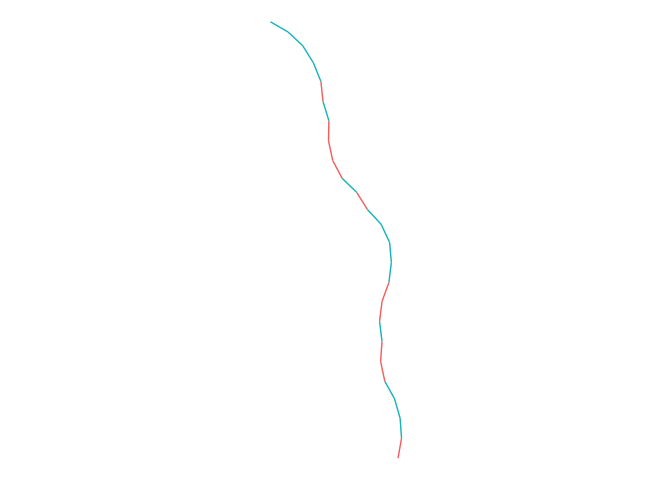

<!-- README.md is generated from README.Rmd. Please edit that file -->
Tree GenViz
===========

Packages
========

``` r
library(tidyverse)
#> ── Attaching packages ──────────────────
#> ✔ ggplot2 2.2.1.9000     ✔ purrr   0.2.4     
#> ✔ tibble  1.4.2          ✔ dplyr   0.7.4.9000
#> ✔ tidyr   0.8.0          ✔ stringr 1.2.0     
#> ✔ readr   1.1.1          ✔ forcats 0.2.0
#> ── Conflicts ── tidyverse_conflicts() ──
#> ✖ dplyr::filter() masks stats::filter()
#> ✖ dplyr::lag()    masks stats::lag()
```

Loading custom functions
========================

``` r
sapply(paste0("R/", list.files("R/")), source, .GlobalEnv)
#>         R/viz_functions.R
#> value   ?                
#> visible FALSE
```

``` r
angle_fun <- function(n, min_angle = 10, max_angle = 20) {
  sign <- sample(c(-1, 1), size = n, replace = TRUE) / 360 * 2 * pi
  size <- sample(min_angle:max_angle, size = n, replace = TRUE)
  sign * size
}
length_fun <- function(n) rpois(n = n, lambda = 20)
```

Example
-------

``` r
treeViz(5, angle_fun, length_fun)
#> # A tibble: 105 x 5
#>    x_from   x_to y_from  y_to group
#>     <dbl>  <dbl>  <dbl> <dbl> <int>
#>  1  0     -0.191   1.00  1.98     1
#>  2 -0.191 -0.691   1.98  2.85     1
#>  3 -0.691 -1.46    2.85  3.49     1
#>  4 -1.46  -2.37    3.49  3.90     1
#>  5 -2.37  -3.10    3.90  4.58     1
#>  6 -3.10  -3.63    4.58  5.43     1
#>  7 -3.63  -4.33    5.43  6.15     1
#>  8 -4.33  -5.20    6.15  6.63     1
#>  9 -5.20  -6.17    6.63  6.89     1
#> 10 -6.17  -7.03    6.89  7.39     1
#> # ... with 95 more rows
```

Try of single branch

``` r
treeViz(1, angle_fun, length_fun) %>%
  ggplot(aes(x = x_from, xend = x_to,
             y = y_from, yend = y_to, 
             group = group)) +
  geom_curve(curvature = 0) +
  coord_fixed() +
  theme_void()
```


Whole tree

``` r
treeViz(25, angle_fun, length_fun) %>%
  ggplot(aes(x = x_from, xend = x_to,
             y = y_from, yend = y_to, 
             group = group, color = group)) +
  geom_curve(curvature = 0, alpha = 0.5) +
  coord_fixed() +
  theme_void() +
  guides(color = "none")
```


