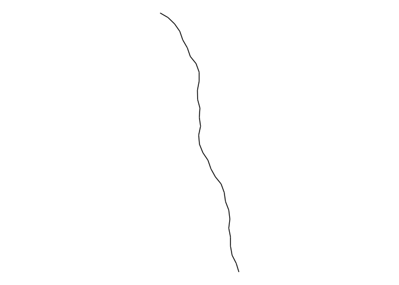
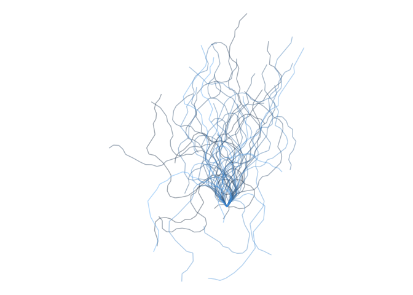

<!-- README.md is generated from README.Rmd. Please edit that file -->
Tree GenViz
===========

Todo

-   variable branch peice length \[✓\]
-   Make work with data instead of Gen \[\]
-   Save direction as variable \[✓\]

Packages
========

``` r
library(tidyverse)
#> ── Attaching packages ──────────────────── tidyverse 1.2.1 ──
#> ✔ ggplot2 2.2.1.9000     ✔ purrr   0.2.4     
#> ✔ tibble  1.4.2          ✔ dplyr   0.7.4.9000
#> ✔ tidyr   0.8.0          ✔ stringr 1.2.0     
#> ✔ readr   1.1.1          ✔ forcats 0.2.0
#> ── Conflicts ─────────────────────── tidyverse_conflicts() ──
#> ✖ dplyr::filter() masks stats::filter()
#> ✖ dplyr::lag()    masks stats::lag()
library(ehlib)
```

Loading custom functions
========================

``` r
sapply(paste0("R/", list.files("R/")), source, .GlobalEnv)
#>         R/viz_functions.R
#> value   ?                
#> visible FALSE
```

Function for random variable angle, variable branch length, and variable twig twig length.

``` r
angle_fun <- function(n, min_angle = 10, max_angle = 20) {
  sign <- sample(c(-1, 1), size = n, replace = TRUE) / 360 * 2 * pi
  size <- sample(min_angle:max_angle, size = n, replace = TRUE)
  sign * size
}

length_fun <- function(n) rpois(n = n, lambda = 20)

twig_fun <- function(n) ehlib::rztpois(n = n, lambda = 2)
```

Example
-------

``` r
treeViz(5, angle_fun, length_fun)
#> # A tibble: 116 x 6
#>    x_from  x_to y_from  y_to group  angle
#>     <dbl> <dbl>  <dbl> <dbl> <int>  <dbl>
#>  1  0     0.309   1.00  1.95     1 -0.314
#>  2  0.309 0.868   1.95  2.78     1 -0.279
#>  3  0.868 1.13    2.78  3.75     1  0.332
#>  4  1.13  1.04    3.75  4.74     1  0.349
#>  5  1.04  1.23    4.74  5.72     1 -0.279
#>  6  1.23  1.68    5.72  6.61     1 -0.279
#>  7  1.68  2.34    6.61  7.37     1 -0.244
#>  8  2.34  2.78    7.37  8.27     1  0.262
#>  9  2.78  3.44    8.27  9.02     1 -0.262
#> 10  3.44  3.79    9.02  9.96     1  0.349
#> # ... with 106 more rows
```

### Single branch

Minimal branch.

``` r
treeViz(1, angle_fun, length_fun) %>%
  ggplot(aes(x = x_from, xend = x_to,
             y = y_from, yend = y_to, 
             group = group)) +
  geom_curve(curvature = 0) +
  coord_fixed() +
  theme_void()
```



With colors depending on direction of path.

``` r
treeViz(1, angle_fun, length_fun) %>%
  mutate(turn_col = angle > 0) %>%
  ggplot(aes(x = x_from, xend = x_to,
             y = y_from, yend = y_to, 
             group = group, color = turn_col)) +
  geom_curve(curvature = 0) +
  coord_fixed() +
  theme_void() +
  guides(color = "none")
```


### Whole tree

Minimal tree. Color by branch id.

``` r
treeViz(25, angle_fun, length_fun) %>%
  ggplot(aes(x = x_from, xend = x_to,
             y = y_from, yend = y_to, 
             group = group, color = group)) +
  geom_curve(curvature = 0, alpha = 0.4) +
  coord_fixed() +
  theme_void() +
  guides(color = "none")
```


Tree. Color depending of direction.

``` r
treeViz(100, angle_fun, length_fun) %>%
    mutate(turn_col = angle > 0) %>%
  ggplot(aes(x = x_from, xend = x_to,
             y = y_from, yend = y_to, 
             group = group, color = turn_col)) +
  geom_curve(curvature = 0, alpha = 0.3) +
  coord_fixed() +
  theme_void() +
  guides(color = "none") +
  scale_color_manual(values = c("#A3BE8C", "#BF616A"))
```


Variable twig length.

``` r
angle_fun <- function(n, min_angle = 20, max_angle = 40) {
  sign <- sample(c(-1, 1), size = n, replace = TRUE) / 360 * 2 * pi
  size <- sample(min_angle:max_angle, size = n, replace = TRUE)
  sign * size
}
length_fun <- function(n) rpois(n = n, lambda = 20)

twig_fun <- function(n) ehlib::rztpois(n = n, lambda = 1)

treeViz(50, angle_fun, length_fun, twig_fun) %>%
  ggplot(aes(x = x_from, xend = x_to,
             y = y_from, yend = y_to, 
             group = group, color = group)) +
  geom_curve(curvature = 0, alpha = 0.4) +
  coord_fixed() +
  theme_void() +
  guides(color = "none")
```


